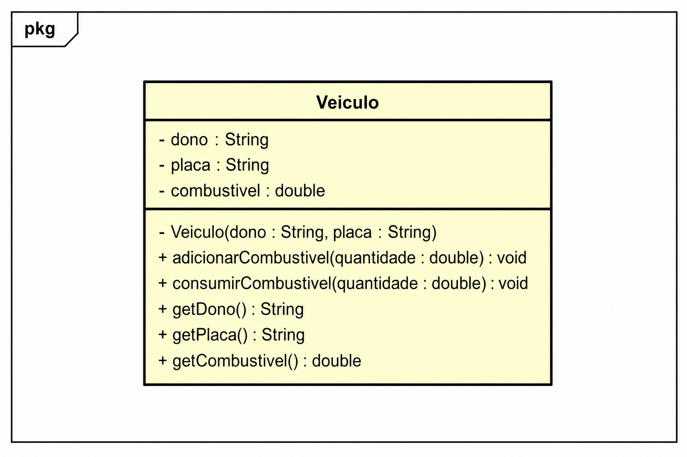

# FiapRide — Missão Refatoração

> **Prova Prática — Programação Orientada a Objetos**
> Refatoração de código legado aplicando **Clean Code, Orientação a Objetos e Encapsulamento**.

---

## Sobre o Projeto

Este projeto faz parte da disciplina de **Programação Orientada a Objetos da FIAP**.

A proposta consiste em analisar e refatorar um código legado do sistema **FiapRide**, responsável pelo cadastro e gerenciamento de veículos.

O código original apresentava problemas relacionados a:

* ❌ Nomes pouco descritivos
* ❌ Falta de encapsulamento
* ❌ Atributos públicos
* ❌ Possibilidade de inserir valores inválidos
* ❌ Métodos pouco claros
* ❌ Permissão para combustível assumir valores negativos
* ❌ Estrutura que não seguia boas práticas de Clean Code

O objetivo da atividade é transformar esse código em uma implementação mais **segura, organizada, legível e orientada a objetos**.

---

## Objetivos

Durante a refatoração, foram aplicados conceitos estudados nas aulas:

* Classes e objetos
* Métodos
* Encapsulamento
* Modificadores de acesso
* Clean Code
* Validação de dados
* Organização de código
* Boas práticas de programação orientada a objetos

---

## Estrutura do Projeto

```text
prova-refatoracao/
│
├── diagrama-veiculo-refatorado.png
│
├── 📁 src/
│   └── 📁 br/
│       └── 📁 com/
│           └── 📁 fiapride/
│               │
│               ├── 📁 model/
│               │   └── Veiculo.java
│               │
│               └── 📁 main/
│                   └── SistemaPrincipal.java
│
└── README.md
```

A estrutura segue a organização de pacotes definida na proposta da atividade.

---

## Diagrama de Classes

O projeto também possui um diagrama de classes desenvolvido no **Astah**, representando a versão refatorada da classe `Veiculo`.

### Diagrama



---

## Classe `Veiculo`

A classe `Veiculo` representa um veículo cadastrado no sistema.

### Principais informações

| Atributo    | Descrição                            |
| ----------- | ------------------------------------ |
| `individuo` | Proprietário do veículo              |
| `pl`        | Placa do veículo                     |
| `gas`       | Quantidade de combustível disponível |

A implementação refatorada busca proteger os dados internos do objeto e evitar estados inválidos.

---

## Encapsulamento

Um dos principais problemas encontrados no código legado era a utilização de atributos públicos.

No código original, era possível fazer diretamente:

```java
v1.gas = -10;
```

Isso permitia que o objeto assumisse um estado inválido.

Na refatoração, o acesso aos atributos é controlado pela própria classe, garantindo maior segurança e permitindo que os valores sejam validados antes de serem alterados.

---

## Controle de Combustível

O sistema possui operações para:

### Adicionar combustível

```java
adicionar(...)
```

Responsável por aumentar a quantidade de combustível disponível.

### Gastar combustível

```java
gasta(...)
```

Responsável por diminuir o combustível disponível, evitando que o veículo fique com uma quantidade inválida.

---

## Clean Code

A refatoração também busca melhorar a qualidade e legibilidade do código através de:

* Nomes de classes seguindo a convenção Java
* Métodos com responsabilidades claras
* Atributos protegidos
* Código mais legível
* Validação dos dados
* Redução de comportamentos inesperados
* Maior organização dos pacotes

---

## Código Legado × Código Refatorado

### Antes

O código original utilizava uma classe chamada:

```java
public class veiculos
```

Além disso, os atributos eram públicos:

```java
public String individuo;
public String pl;
public int gas;
```

Isso permitia alterações diretas e valores inválidos.

### Depois

A classe foi reorganizada seguindo as convenções e princípios de orientação a objetos, utilizando encapsulamento e controle sobre os dados internos.

---

## Tecnologias Utilizadas

* **Java**
* **Programação Orientada a Objetos**
* **Astah UML**
* **Eclipse IDE**
* **Git & GitHub**

---

## Conteúdos Aplicados

A atividade aborda os conteúdos das **Aulas 01, 02 e 03**:

1. Classes
2. Métodos
3. Clean Code
4. Encapsulamento

Esses conceitos foram utilizados para transformar o código legado em uma implementação mais organizada e segura.

---

## Entrega

Para a entrega, o repositório deve conter:

* `diagrama-veiculo-refatorado.png`
* `src/br/com/fiapride/model/Veiculo.java`
* `src/br/com/fiapride/main/SistemaPrincipal.java`
* `README.md`

A proposta também solicita que o repositório seja **público** e que todos os arquivos necessários estejam presentes.

---

## Autor

**Guilherme Blanco Ribeiro**

Projeto acadêmico desenvolvido para a disciplina de **Programação Orientada a Objetos — FIAP**.

---

<p align="center">
  🚗 <strong>FiapRide</strong> — Refatorando código legado com Clean Code e Orientação a Objetos.
</p>
